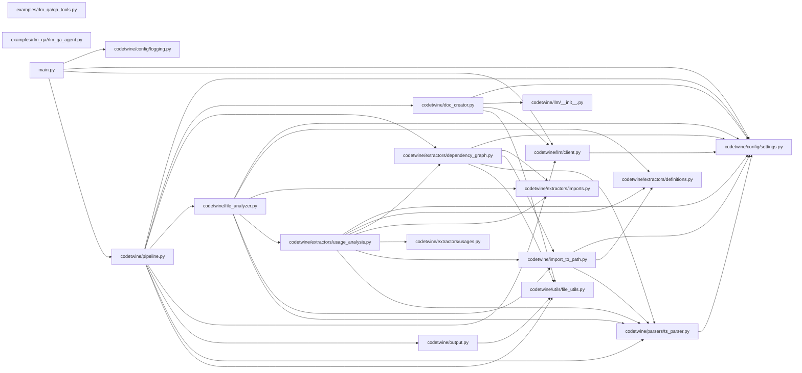

```mermaid
graph LR
    codetwine_codetwine_config_logging_py_logging_py["codetwine/config/logging.py"]
    codetwine_codetwine_config_settings_py_settings_py["codetwine/config/settings.py"]
    codetwine_codetwine_doc_creator_py_doc_creator_py["codetwine/doc_creator.py"]
    codetwine_codetwine_extractors_definitions_py_definitions_py["codetwine/extractors/definitions.py"]
    codetwine_codetwine_extractors_dependency_graph_py_dependency_graph_py["codetwine/extractors/dependency_graph.py"]
    codetwine_codetwine_extractors_imports_py_imports_py["codetwine/extractors/imports.py"]
    codetwine_codetwine_extractors_usage_analysis_py_usage_analysis_py["codetwine/extractors/usage_analysis.py"]
    codetwine_codetwine_extractors_usages_py_usages_py["codetwine/extractors/usages.py"]
    codetwine_codetwine_file_analyzer_py_file_analyzer_py["codetwine/file_analyzer.py"]
    codetwine_codetwine_import_to_path_py_import_to_path_py["codetwine/import_to_path.py"]
    codetwine_codetwine_llm___init___py___init___py["codetwine/llm/__init__.py"]
    codetwine_codetwine_llm_client_py_client_py["codetwine/llm/client.py"]
    codetwine_codetwine_output_py_output_py["codetwine/output.py"]
    codetwine_codetwine_parsers_ts_parser_py_ts_parser_py["codetwine/parsers/ts_parser.py"]
    codetwine_codetwine_pipeline_py_pipeline_py["codetwine/pipeline.py"]
    codetwine_codetwine_utils_file_utils_py_file_utils_py["codetwine/utils/file_utils.py"]
    codetwine_examples_rlm_qa_qa_tools_py_qa_tools_py["examples/rlm_qa/qa_tools.py"]
    codetwine_examples_rlm_qa_rlm_qa_agent_py_rlm_qa_agent_py["examples/rlm_qa/rlm_qa_agent.py"]
    codetwine_main_py_main_py["main.py"]
    codetwine_codetwine_doc_creator_py_doc_creator_py --> codetwine_codetwine_config_settings_py_settings_py
    codetwine_codetwine_doc_creator_py_doc_creator_py --> codetwine_codetwine_llm___init___py___init___py
    codetwine_codetwine_doc_creator_py_doc_creator_py --> codetwine_codetwine_llm_client_py_client_py
    codetwine_codetwine_doc_creator_py_doc_creator_py --> codetwine_codetwine_utils_file_utils_py_file_utils_py
    codetwine_codetwine_extractors_dependency_graph_py_dependency_graph_py --> codetwine_codetwine_config_settings_py_settings_py
    codetwine_codetwine_extractors_dependency_graph_py_dependency_graph_py --> codetwine_codetwine_extractors_imports_py_imports_py
    codetwine_codetwine_extractors_dependency_graph_py_dependency_graph_py --> codetwine_codetwine_import_to_path_py_import_to_path_py
    codetwine_codetwine_extractors_dependency_graph_py_dependency_graph_py --> codetwine_codetwine_parsers_ts_parser_py_ts_parser_py
    codetwine_codetwine_extractors_dependency_graph_py_dependency_graph_py --> codetwine_codetwine_utils_file_utils_py_file_utils_py
    codetwine_codetwine_extractors_usage_analysis_py_usage_analysis_py --> codetwine_codetwine_config_settings_py_settings_py
    codetwine_codetwine_extractors_usage_analysis_py_usage_analysis_py --> codetwine_codetwine_extractors_definitions_py_definitions_py
    codetwine_codetwine_extractors_usage_analysis_py_usage_analysis_py --> codetwine_codetwine_extractors_dependency_graph_py_dependency_graph_py
    codetwine_codetwine_extractors_usage_analysis_py_usage_analysis_py --> codetwine_codetwine_extractors_imports_py_imports_py
    codetwine_codetwine_extractors_usage_analysis_py_usage_analysis_py --> codetwine_codetwine_extractors_usages_py_usages_py
    codetwine_codetwine_extractors_usage_analysis_py_usage_analysis_py --> codetwine_codetwine_import_to_path_py_import_to_path_py
    codetwine_codetwine_extractors_usage_analysis_py_usage_analysis_py --> codetwine_codetwine_parsers_ts_parser_py_ts_parser_py
    codetwine_codetwine_file_analyzer_py_file_analyzer_py --> codetwine_codetwine_config_settings_py_settings_py
    codetwine_codetwine_file_analyzer_py_file_analyzer_py --> codetwine_codetwine_extractors_definitions_py_definitions_py
    codetwine_codetwine_file_analyzer_py_file_analyzer_py --> codetwine_codetwine_extractors_imports_py_imports_py
    codetwine_codetwine_file_analyzer_py_file_analyzer_py --> codetwine_codetwine_extractors_usage_analysis_py_usage_analysis_py
    codetwine_codetwine_file_analyzer_py_file_analyzer_py --> codetwine_codetwine_import_to_path_py_import_to_path_py
    codetwine_codetwine_file_analyzer_py_file_analyzer_py --> codetwine_codetwine_parsers_ts_parser_py_ts_parser_py
    codetwine_codetwine_import_to_path_py_import_to_path_py --> codetwine_codetwine_config_settings_py_settings_py
    codetwine_codetwine_import_to_path_py_import_to_path_py --> codetwine_codetwine_extractors_definitions_py_definitions_py
    codetwine_codetwine_import_to_path_py_import_to_path_py --> codetwine_codetwine_parsers_ts_parser_py_ts_parser_py
    codetwine_codetwine_llm_client_py_client_py --> codetwine_codetwine_config_settings_py_settings_py
    codetwine_codetwine_output_py_output_py --> codetwine_codetwine_utils_file_utils_py_file_utils_py
    codetwine_codetwine_parsers_ts_parser_py_ts_parser_py --> codetwine_codetwine_config_settings_py_settings_py
    codetwine_codetwine_pipeline_py_pipeline_py --> codetwine_codetwine_config_settings_py_settings_py
    codetwine_codetwine_pipeline_py_pipeline_py --> codetwine_codetwine_doc_creator_py_doc_creator_py
    codetwine_codetwine_pipeline_py_pipeline_py --> codetwine_codetwine_extractors_dependency_graph_py_dependency_graph_py
    codetwine_codetwine_pipeline_py_pipeline_py --> codetwine_codetwine_file_analyzer_py_file_analyzer_py
    codetwine_codetwine_pipeline_py_pipeline_py --> codetwine_codetwine_llm_client_py_client_py
    codetwine_codetwine_pipeline_py_pipeline_py --> codetwine_codetwine_output_py_output_py
    codetwine_codetwine_pipeline_py_pipeline_py --> codetwine_codetwine_parsers_ts_parser_py_ts_parser_py
    codetwine_codetwine_pipeline_py_pipeline_py --> codetwine_codetwine_utils_file_utils_py_file_utils_py
    codetwine_main_py_main_py --> codetwine_codetwine_config_logging_py_logging_py
    codetwine_main_py_main_py --> codetwine_codetwine_config_settings_py_settings_py
    codetwine_main_py_main_py --> codetwine_codetwine_llm_client_py_client_py
    codetwine_main_py_main_py --> codetwine_codetwine_pipeline_py_pipeline_py
```